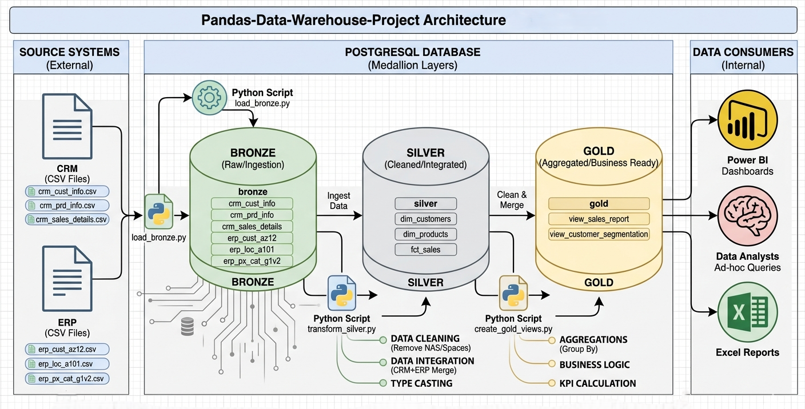

# Data Warehouse and Analytics Project 🚀

Welcome to the **Data Warehouse and Analytics Project** repository! 
This project demonstrates a comprehensive data warehousing and analytics solution using Python and SQL, covering everything from raw data ingestion to generating actionable business insights.

---

## 📖 Project Overview
This project involves building a modern data warehouse using the **Medallion Architecture** (Bronze, Silver, and Gold layers).

1. **Data Architecture**: Designing a 3-tier warehouse for structured data.
2. **ETL Pipelines**: Extracting, transforming, and loading data from ERP and CRM systems.
3. **Data Modeling**: Developing Fact and Dimension tables (Star Schema).
4. **Analytics & Reporting**: Validating data integrity and preparing it for BI tools.

---

## 🏗️ Data Architecture
The data flows through three main stages as shown in the diagram below:

 


1. **Bronze Layer**: Stores raw data as-is from source systems (CSV files).
2. **Silver Layer**: Performs data cleansing, standardization, and handling missing values.
3. **Gold Layer**: Houses business-ready data modeled into a **Star Schema** for reporting.

---

## 🛠️ Tools & Technologies
- **Language**: Python (Pandas, SQLAlchemy)
- **Database**: SQL Server (or PostgreSQL/SQLite)
- **Environment**: Jupyter Notebooks / Python Scripts
- **Documentation**: Draw.io (for diagrams)
- **Version Control**: Git & GitHub

---

## 📂 Repository Structure
```text
data-warehouse-project/
├── datasets/            # Raw CSV files (ERP and CRM data)
├── scripts/             # Python ETL scripts
│   ├── bronze/          # Ingestion logic
│   ├── silver/          # Cleaning & Transformation
│   └── gold/            # Final Data Modeling
├── tests/               # Quality Check scripts
├── docs/                # Architecture diagrams and data catalog
├── README.md            # Project documentation
└── requirements.txt     # Python dependencies
